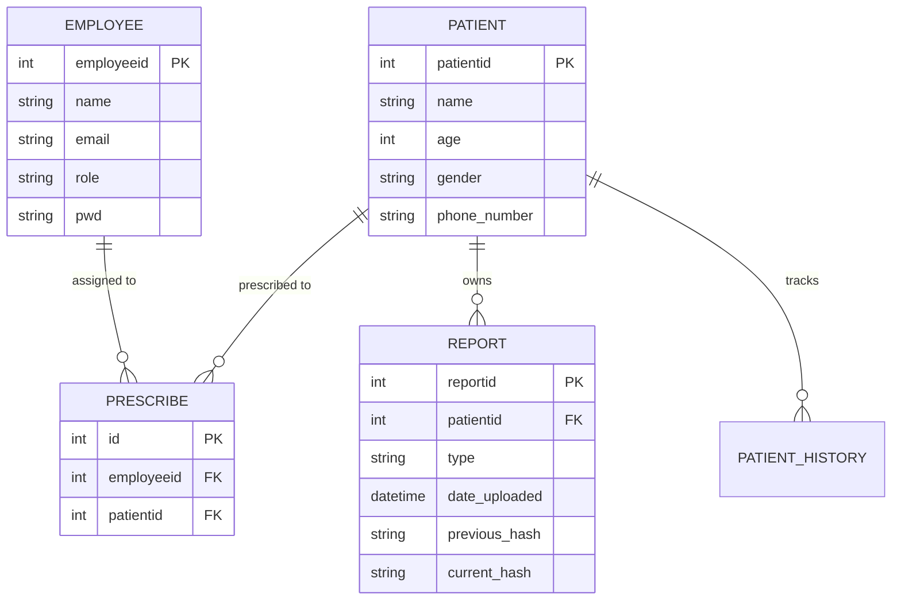

# DBMS Project Report: Patient Management System (Hospital Management)

**Course**: UCS310 – Database Management Systems  
**Degree & Year**: B.Tech (2nd Year)  
**Department**: Computer Science & Engineering  
**Academic Year**: 2025-26  

---

## 1. Introduction
### Application Domain
The **Patient Management System (PMS)** is a specialized Database Management System designed for healthcare environments. It streamlines the lifecycle of patient care, from registration and doctor assignment to medical reporting and history tracking.

### Motivation
In modern healthcare, data is fragmented across various departments. Selecting this problem allows for the implementation of advanced security features like **Row-Level Security (RLS)** and **Cryptographic Integrity**, which are critical in protecting sensitive patient information.

### Importance of DBMS vs File-based System
1. **Data Consistency**: Prevents conflicting records in different files.
2. **Security**: Allows granular access control (who can see which patient).
3. **Concurrency**: Multiple doctors can update records simultaneously without data loss.
4. **Data Integrity**: Ensures that medical reports cannot be orphaned or tampered with.

---

## 2. Problem Statement
Manual or file-based hospital systems suffer from:
- **Redundancy**: Patient details are repeated in every department's ledger.
- **Security Risks**: No way to restrict a doctor from viewing another doctor's private patient files.
- **Tampering**: Medical reports can be altered after the fact with no audit trail.
- **Search Efficiency**: Retrieving years of patient history from physical files is time-consuming.

**Scope**: This project implements a backend-focused solution using PostgreSQL to automate these processes securely.

---

## 3. Objectives of the Project
1. To design a robust database using **E–R data modeling**.
2. To convert the ER model into **normalized relational tables (3NF)**.
3. To implement **PL/SQL Procedures** for secure patient registration.
4. To use **Cursors** for generating medical summaries.
5. To ensure data integrity using **Triggers** for hash-chaining and audit logs.
6. To enforce security via **Row-Level Security (RLS)** policies.

---

## 4. Scope of the Project
- **Admin Module**: Manage employees (doctors/staff).
- **Doctor Module**: View assigned patients, upload medical reports, and view patient history.
- **Security Module**: Cryptographic hashing of reports to detect tampering.
- **Audit Module**: Automatic tracking of every change made to patient records.

---

## 5. Database Design
### 5.1 Entity-Relationship (ER) Diagram

### 5.2 Relational Schema
- **Employees**(`employeeid` [PK], `name`, `email`, `role`, `pwd`)
- **Patients**(`patientid` [PK], `name`, `age`, `gender`, `phone_number`)
- **Prescribe**(`id` [PK], `employeeid` [FK], `patientid` [FK])
- **Reports**(`reportid` [PK], `patientid` [FK], `type`, `date_uploaded`, `previous_hash`, `current_hash`)

---

## 6. Normalization
### Functional Dependencies
- `patientid` -> {`name`, `age`, `gender`, `phone_number`}
- `employeeid` -> {`name`, `email`, `role`, `pwd`}
- `reportid` -> {`patientid`, `type`, `date_uploaded`, `hashes`}

### Normalization Steps
1. **1NF**: All attributes are atomic. No multi-valued attributes (e.g., multiple phone numbers are handled as separate entries if needed).
2. **2NF**: All non-key attributes are fully dependent on the Primary Key. Since all our PKs are simple (not composite), 2NF is satisfied.
3. **3NF**: There are no transitive dependencies. `name` depends on `patientid`, and nothing else depends on `name`.

---

## 7. Implementation Highlights (SQL/PLSQL)
*Full code is available in `backend/prisma/dbms_implementation.sql`.*

- **Stored Procedure**: `sp_register_patient_secure` - Atomically registers a patient and links them to a doctor.
- **Function**: `calculate_report_hash` - Generates a SHA256 linkage for data integrity.
- **Trigger**: `archive_patient_history` - Captures the "Before" state of a record on Update/Delete.
- **Cursor**: `generate_doctor_stats` - Iterates through doctors to calculate their patient load.

---

## 8. Expected Outcomes
1. **Zero Data Redundancy**: Normalized schema ensures data is stored once.
2. **Enhanced Security**: Doctors can only see their own patients via RLS.
3. **Immutable History**: Triggers ensure that every edit is logged in `patient_history`.
4. **Data Verification**: The integrity view identifies tampered reports using hash-chaining logic.
