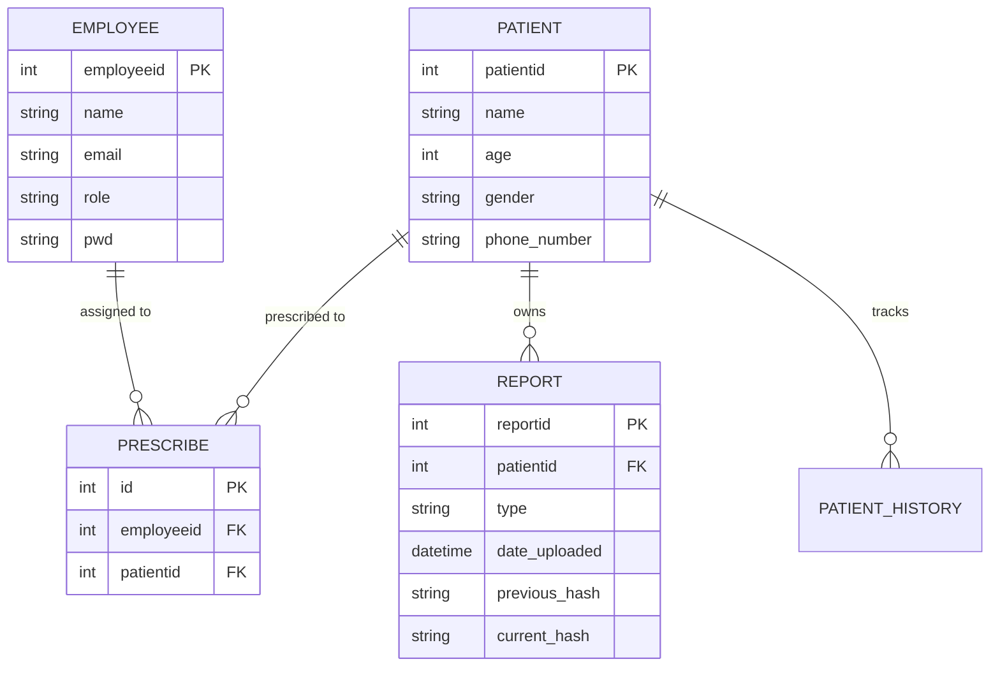

# Patient Management System - Technical Documentation

**Course**: UCS310 - Database Management Systems  
**Degree**: B.Tech (2nd Year)  
**Department**: Computer Science & Engineering  
**Academic Year**: 2025-26

---

## 1. Project Overview

The Patient Management System (PMS) is a specialized Database Management System designed for healthcare environments. It streamlines the lifecycle of patient care, from registration and doctor assignment to medical reporting and history tracking.

### 1.1 Technology Stack

| Service | Technology | Port |
|---------|------------|------|
| Backend | Express + TypeScript | 8080 |
| Auth | Passport-JWT | 3000 |
| Admin | Django | 8000 |
| Database | PostgreSQL 16 | 5432 |

### 1.2 Architecture

The system uses Docker Compose to orchestrate:
- **backend** - Main API server handling patient operations
- **auth** - JWT authentication service
- **admin** - Django admin interface
- **db** - PostgreSQL database

---

## 2. Database Schema

### 2.1 Entity Relationship



### 2.2 Relational Schema

| Table | Columns |
|-------|---------|
| employees | employeeid (PK), name, email, role, pwd, phone_number |
| patients | patientid (PK), name, age, gender, phone_number |
| prescribe | id (PK), employeeid (FK), patientid (FK) |
| reports | reportid (PK), patientid (FK), type, date_uploaded, previous_hash, current_hash |
| patient_history | id (PK), patientid, name, age, gender, phone_number, changed_at, changed_by, operation |
| system_audit_logs | log_id (PK), event_name, performed_by, event_timestamp, details |

---

## 3. API Documentation

### Base URL
```
http://localhost:8080
```

### Authentication
All protected endpoints require a Bearer token in the Authorization header:
```
Authorization: Bearer <jwt_token>
```

### Endpoints

#### 3.1 Public Endpoints

| Method | Endpoint | Description | Request Body | Response |
|--------|----------|-------------|-------------|----------|
| GET | `/` | Health check | - | `{"message": "I am a TeaPot"}` |
| POST | `/login` | User authentication | `{"email": string, "password": string}` | `{"token": string}` |

#### 3.2 Protected Endpoints

| Method | Endpoint | Description | Request Body | Response |
|--------|----------|-------------|-------------|----------|
| GET | `/patients` | List patients (RLS-filtered) | - | `{"patients": [...]} |
| GET | `/patient/:id` | Get patient by ID | - | `{"patient": {...}}` |
| GET | `/account` | Get current employee | - | `{"account": {...}}` |
| GET | `/patient/:id/history` | Get patient history | - | `{"patient_id": int, "version_count": int, "history": [...]}` |
| GET | `/analytics/integrity` | Hash-chain audit | - | `{"integrityReport": [...]}` |
| POST | `/analytics/refresh-stats` | Generate activity report | - | `{"message": "Activity report generated..."}` |

### 3.3 Response Examples

**GET /patients Response:**
```json
{
  "patients": [
    {
      "patientid": 1,
      "name": "John Doe",
      "age": 45,
      "gender": "Male",
      "phone_number": "1234567890",
      "reports": [...]
    }
  ]
}
```

**GET /patient/:id Response:**
```json
{
  "patient": {
    "patientid": 1,
    "name": "John Doe",
    "age": 45,
    "gender": "Male",
    "reports": [...],
    "prescriptions": [
      {
        "employee": {
          "employeeid": 1,
          "name": "Dr. Smith"
        }
      }
    ]
  }
}
```

**GET /patient/:id/history Response:**
```json
{
  "patient_id": 1,
  "version_count": 3,
  "history": [
    {
      "id": 3,
      "patientid": 1,
      "name": "John Doe",
      "age": 44,
      "gender": "Male",
      "changed_at": "2025-01-15T10:30:00Z",
      "changed_by": 1,
      "operation": "UPDATE"
    }
  ]
}
```

**GET /analytics/integrity Response:**
```json
{
  "integrityReport": [
    {
      "reportid": 1,
      "patientid": 1,
      "report_type": "Blood Test",
      "current_hash": "a1b2c3...",
      "previous_hash": "x9y8z7...",
      "integrity_status": "VERIFIED"
    }
  ]
}
```

---

## 4. Business Logic

### 4.1 Row-Level Security (RLS)

The system implements database-level security where access control happens in PostgreSQL, not the application layer.

**How it works:**
1. JWT token contains `employeeid` and `role`
2. Backend sets `app.current_employee_id` session variable using Prisma extension
3. RLS policies filter data based on this session variable

**Policy Logic:**
- **Admin** - Can access all records
- **Doctor** - Can only access patients assigned to them via `prescribe` table

**Prisma Extension:**
```typescript
const prisma = basePrisma.$extends({
  client: {
    $withUser(employeeId: number) {
      return basePrisma.$extends({
        query: {
          $allModels: {
            async $allOperations({ args, query }) {
              const [, result] = await basePrisma.$transaction([
                basePrisma.$executeRawUnsafe(
                  `SELECT set_config('app.current_employee_id', '${employeeId}', true)`
                ),
                query(args)
              ]);
              return result;
            }
          }
        }
      });
    }
  }
});
```

### 4.2 Temporal System-Versioning

Every UPDATE or DELETE on the `patients` table triggers an archive to `patient_history`.

**Trigger:** `patient_changes_trigger`
- Fires: BEFORE UPDATE OR DELETE
- Captures: OLD record state, timestamp, and performing employee

**Stored Data:**
- Who made the change (changed_by)
- When it happened (changed_at)
- What changed (full record snapshot)
- Operation type (UPDATE/DELETE)

### 4.3 Cryptographic Hash-Chaining

Each medical report is cryptographically linked to form an immutable chain.

**Hash Calculation:**
```
Hash = SHA256(patientid + type + date_uploaded + previous_hash)
```

**Chain Integrity:**
- First report uses genesis seed `0xGENESIS_SEED_...`
- Each subsequent report's `previous_hash` equals the previous report's `current_hash`
- Any modification breaks the chain mathematically

**Integrity View:** `health_integrity_audit`
- Recalculates hashes on-the-fly
- Returns `VERIFIED` or `TAMPERED_OR_CORRUPT`

### 4.4 Patient Registration

Atomic registration via stored procedure `sp_register_patient_secure`:
1. Insert patient record
2. Create prescribe link to doctor
3. Log event to system_audit_logs
4. All in single transaction (commit/rollback)

---

## 5. SQL Components

### 5.1 Stored Procedures

**sp_register_patient_secure**
```sql
CREATE OR REPLACE PROCEDURE sp_register_patient_secure(
    p_name VARCHAR,
    p_age INTEGER,
    p_gender VARCHAR,
    p_phone VARCHAR,
    p_doctor_id INTEGER
)
```

**sp_generate_doctor_activity_report**
```sql
CREATE OR REPLACE PROCEDURE sp_generate_doctor_activity_report()
```
Uses cursor to iterate through doctors and calculate patient load.

### 5.2 Functions

**get_current_employee_id()**
```sql
CREATE OR REPLACE FUNCTION get_current_employee_id()
RETURNS INTEGER AS $$
BEGIN
    RETURN NULLIF(current_setting('app.current_employee_id', TRUE), '')::INTEGER;
EXCEPTION WHEN OTHERS THEN
    RETURN NULL;
END;
$$ LANGUAGE plpgsql STABLE;
```

**calculate_report_hash()**
```sql
CREATE OR REPLACE FUNCTION calculate_report_hash()
RETURNS TRIGGER AS $$
DECLARE
    prev_hash TEXT;
BEGIN
    -- Get latest report hash for patient
    SELECT current_hash INTO prev_hash
    FROM reports
    WHERE patientid = NEW.patientid
    ORDER BY date_uploaded DESC, reportid DESC
    LIMIT 1;

    -- Genesis hash if first report
    IF prev_hash IS NULL THEN
        prev_hash := '0xGENESIS_SEED_...';
    END IF;

    NEW.previous_hash := prev_hash;
    NEW.current_hash := encode(
        digest(
            COALESCE(NEW.patientid::TEXT, '0') ||
            COALESCE(NEW.type::TEXT, 'unknown') ||
            COALESCE(NEW.date_uploaded::TEXT, 'now') ||
            prev_hash,
            'sha256'
        ),
        'hex'
    );
    RETURN NEW;
END;
$$ LANGUAGE plpgsql;
```

### 5.3 Views

**doctor_patient_details**
```sql
CREATE OR REPLACE VIEW doctor_patient_details AS
SELECT 
    e.name AS doctor_name,
    p.name AS patient_name,
    p.age,
    p.gender
FROM employees e
JOIN prescribe pr ON e.employeeid = pr.employeeid
JOIN patients p ON pr.patientid = p.patientid
WHERE e.role = 'doctor';
```

**health_integrity_audit**
```sql
CREATE OR REPLACE VIEW health_integrity_audit AS
SELECT
    reportid,
    patientid,
    type AS report_type,
    current_hash,
    previous_hash,
    CASE
        WHEN current_hash = encode(digest(...), 'hex')
        THEN 'VERIFIED'
        ELSE 'TAMPERED_OR_CORRUPT'
    END AS integrity_status
FROM reports;
```

### 5.4 Triggers

**patient_changes_trigger**
- Table: `patients`
- Timing: BEFORE UPDATE OR DELETE
- Function: `archive_patient_history()`

**report_hash_trigger**
- Table: `reports`
- Timing: BEFORE INSERT
- Function: `calculate_report_hash()`

---

## 6. RLS Policies

### 6.1 Patients Policy
```sql
CREATE POLICY patient_access_policy ON patients
FOR ALL
USING (
    EXISTS (
        SELECT 1 FROM employees e
        WHERE e.employeeid = get_current_employee_id()
        AND e.role = 'admin'
    )
    OR patientid IN (
        SELECT patientid FROM prescribe
        WHERE employeeid = get_current_employee_id()
    )
);
```

### 6.2 Reports Policy
```sql
CREATE POLICY report_access_policy ON reports
FOR ALL
USING (
    EXISTS (
        SELECT 1 FROM employees e
        WHERE e.employeeid = get_current_employee_id()
        AND e.role = 'admin'
    )
    OR patientid IN (
        SELECT patientid FROM prescribe
        WHERE employeeid = get_current_employee_id()
    )
);
```

### 6.3 Prescribe Policy
```sql
CREATE POLICY prescribe_access_policy ON prescribe
FOR ALL
USING (
    EXISTS (
        SELECT 1 FROM employees e
        WHERE e.employeeid = get_current_employee_id()
        AND e.role = 'admin'
    )
    OR employeeid = get_current_employee_id()
);
```

---

## 7. Normalization

### 7.1 Functional Dependencies
- `patientid` -> {name, age, gender, phone_number}
- `employeeid` -> {name, email, role, pwd}
- `reportid` -> {patientid, type, date_uploaded, hashes}

### 7.2 Normal Forms
- **1NF**: All attributes atomic (no multi-valued attributes)
- **2NF**: All non-key attributes fully dependent on primary key
- **3NF**: No transitive dependencies

---

## 8. Setup & Deployment

### 8.1 Prerequisites
- Docker
- Docker Compose
- PostgreSQL 16

### 8.2 Environment Variables
```env
DATABASE_URL=postgresql://user:pass@db:5432/hospital_management
JWT_SECRET=your_secret_key
```

### 8.3 Running the Application
```bash
docker-compose up --build
```

### 8.4 Database Setup
Execute these SQL files in order:
1. `backend/prisma/dbms_implementation.sql` - Procedures, functions, views
2. `backend/prisma/rls_setup.sql` - RLS policies, triggers, hash chain

---

## 9. Security Considerations

### 9.1 Current Implementation
- JWT authentication with 1-hour expiry
- RLS at database level
- Password comparison (plain text in demo, bcrypt in production)

### 9.2 Recommended Improvements
- Use bcrypt for password hashing
- Add rate limiting
- Implement SSL/TLS
- Add input validation/sanitization

---

## 10. File Structure

```
/home/baltej/Desktop/dbms_project/
├── admin/                    # Django admin
│   ├── admin/               # Django settings
│   └── fam/                # Models (Patient, Employee, Prescribe, Report)
├── auth/                    # JWT Auth service
│   ├── main.js             # Compiled entry
│   └── index.js            # Source
├── backend/                 # Express API
│   ├── main.ts             # Entry point
│   ├── middlewares/        # verifyToken, JsonErrorChecker
│   └── prisma/           # SQL implementations
│       ├── dbms_implementation.sql
│       └── rls_setup.sql
├── docker-compose.yml
└── README.md
```